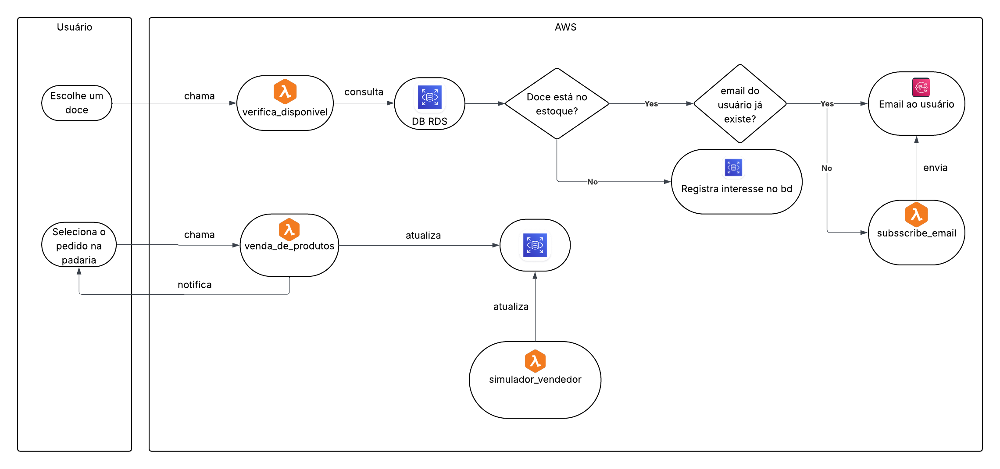
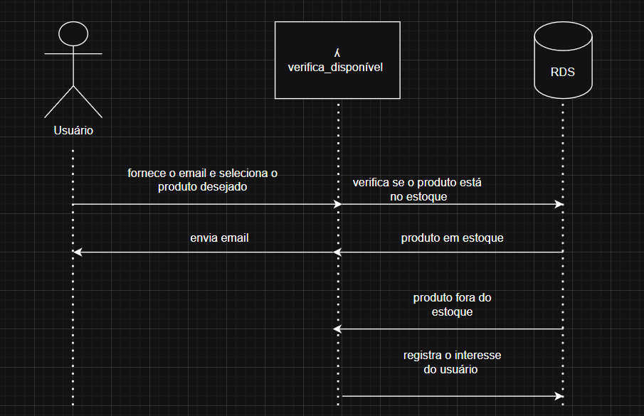
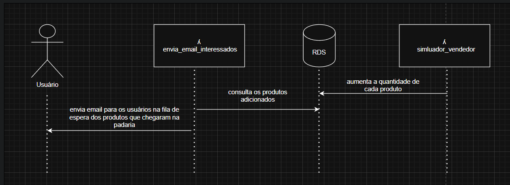
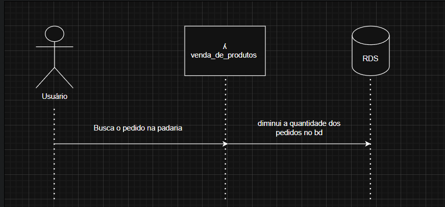

# INF1304-T2


## 🍰 Projeto Quitute nas Nuvens

Aplicação para uma padraria inteligente usando a nuvem da Amazon (AWS). A aplicação funciona como um *marketplace* , com um fornecedor entregando produtos e a padraria se encarregando de vendê-los.

## 🤝 Membros da dupla

Lívia Lutz dos Santos - 2211055

Thiago Pereira Camerato - 2212580

## 📌 Objetivo

Desenvolver uma aplicação web para gerenciamento de reservas de quitutes em uma padaria virtual, integrando serviços da AWS (Lambda, RDS, SNS) para automatizar o controle de estoque e notificações aos clientes.

## 📊 Diagramas

### Diagrama de Blocos da Arquitetura



### Diagramas UML de sequência

#### Verificação de Disponibilidade



#### Envio de Email



#### Venda de Produtos



## Requisitos Implementados

**Funções Lambda :**
- `Entrega de produtos` - Popula o banco de dados com 20 produtos da padaria, simulando a entrega de produtos pelo fornecedor
- `Verificação de disponibilidade de um produto` - Verifica disponibilidade de produtos e registra interesse de clientes em caso de indisponibilidade
- `Envio de emails` - Notifica clientes quando produtos desejados chegam e estão disponíveis para serem retirados na padaria
- `Venda de um produto` - Atualiza estoque após venda de produtos

**Banco de Dados:**
- MySQL no Amazon RDS com tabelas:
  - `consumidor_item` - Catálogo de produtos (Id, nome e quantidade em estoque)
  - `consumidor_reserva` - Registro de reservas dos clientes
  - `consumidor_notificacao` - Fila de notificações para clientes aguardando produtos

**Envio de E-mail:**
- Amazon SNS (Simple Notification Service) através do tópico `ProdutoDisponivel`
- Notificações automáticas quando produtos ficam disponíveis por email
- Confirmação de reserva por e-mail

**Interface com Usuário:**
- Aplicação web Django com templates HTML/CSS
- Navegação de produtos disponíveis
- Sistema de reserva com captura de e-mail
- Notificações automáticas de disponibilidade por email

### Funcionamento

1. **Cliente interessado em produto:**
   - Acessa a interface web, informa seu e-mail e seleciona o produto desejado

2. **Produto disponível:**
   - Sistema envia e-mail imediatamente via SNS
   - Cliente deve comparecer à padaria para efetivar a compra
   - Estoque é atualizado após confirmação

3. **Produto indisponível:**
   - Sistema registra interesse no banco de dados
   - Quando o produto chegar com a reposição do estoque pelo fornecedor, disparamos notificações por email aos interessados na fila de espera


4. **Controle de estoque:**
   - Todas as informações armazenadas no MySQL (RDS)
   - Funções lambda gerenciam entrada e saída de produtos
   - Banco de dados mantém histórico de reservas e vendas

## 🔧 Instalação da Aplicação

### Passos de Instalação

1. **Clone o repositório:**
   ```bash
   git clone https://github.com/livlutz/INF1304-T2.git
   cd INF1304-T2
   ```

   Como alternativa podemos também dar um fork no repositório.

2. **Crie um ambiente virtual:**
   ```bash
   python -m venv venv
   source venv/bin/activate  # Linux/Mac
   # ou
   venv\Scripts\activate  # Windows
   ```

3. **Instale as dependências:**
   ```bash
   pip install -r requirements.txt
   ```

4. **Configure o banco de dados RDS:**
   - Crie uma instância MySQL no Amazon RDS
   - Anote o endpoint, usuário e senha
   - Execute o schema em `database/schema.sql` (se aplicável)

5. **Configure variáveis de ambiente:**
   - Crie um arquivo `.env` na raiz do projeto:
   ```env
   DB_HOST=seu-endpoint-rds.us-east-1.rds.amazonaws.com
   DB_USER=seu_usuario
   DB_PASSWORD=sua_senha
   DB_NAME=padaria-db
   DB_PORT=3306
   ```

6. **Configure o SNS na AWS:**
   - Acesse o Console AWS → SNS
   - Crie um tópico chamado `ProdutoDisponivel`
   - Inscreva seu e-mail no tópico para receber notificações
   - Confirme a inscrição através do e-mail recebido


7. **Execute as migrações do Django:**
   ```bash
   python manage.py migrate
   ```

8. **Deploy das Funções Lambda:**
   - Acesse AWS Lambda Console
   - Crie 5 funções Lambda com Python 3.11+
   - Faça upload dos arquivos em `lambda_functions/`:
     - `simulador_vendedor.py`
     - `verifica_disponivel.py`
     - `envia_email_interessados.py`
     - `venda_de_produtos.py`
     - `subscribe_email.py`
   - Configure variáveis de ambiente nas funções Lambda (credenciais RDS)

9. **Rode o script para atualizar o banco de dados:**
   ```bash
   ./atualizar_banco.sh
   ```

## 📖 Instruções de Operação

### Iniciar a Aplicação

```bash
python manage.py runserver
```

ou, alternativamente podemos executar o script bash na raiz do projeto para levantar a aplicação:

```bash
./run.sh
```

Acesse em seu navegador: `http://localhost:8000` ou navegue até a aba Portas do terminal e clique no link gerado na porta 8000.

### Fluxo de Uso - Cliente

1. **Acessar a aplicação:**
   - Abra `http://localhost:8000`
   - Insira seu e-mail na página inicial
   - Clique em "Continuar"

2. **Navegar pelos produtos:**
   - Visualize a lista de quitutes disponíveis
   - Veja quantidade em estoque de cada item

3. **Reservar um produto:**
   - Clique no produto desejado
   - Preencha seu nome e quantidade
   - Clique em "Reservar"

4. **Receber notificações:**
   - **Se disponível:** Recebe e-mail imediato para comparecer à padaria
   - **Se indisponível:** Fica na fila e recebe e-mail quando produto chegar

### Operações Administrativas (Lambda Functions)

**Adicionar produtos ao estoque:**
- Execute a função Lambda `entrega_de_produtos`
- Popula o banco de dados com alguns itens em certas quantidades
- Dispara notificações para clientes na fila de espera aguardando seus respectivos itens chegarem no estoque da padaria

**Verificar disponibilidade:**
- Execute a função Lambda `verifica_disponivel`
- Verifica se um produto requisitado pelo usuário se encontra no estoque

**Notificar clientes:**
- Execute a função Lambda `envia_email_interessados`
- Envia e-mails para todos os clientes na fila de um produto específico

**Registrar venda:**
- Execute a função Lambda `venda_de_produtos`
- Atualiza estoque após compra confirmada, diminuindo a quantidade dos respectivos itens.